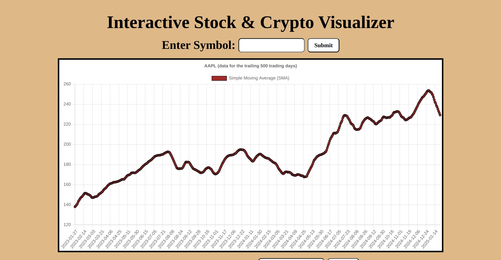
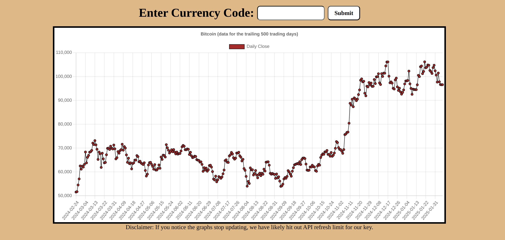
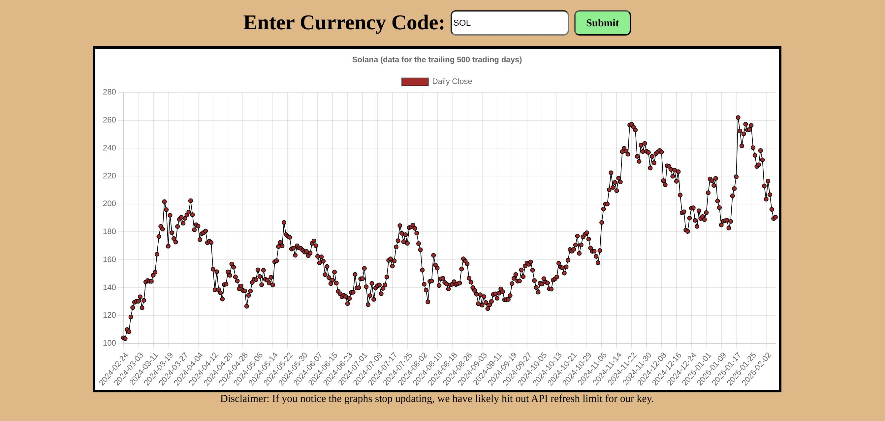

# Realtime Stock Visualization

This project is an interactive stock visualization tool designed to help users explore and analyze financial market trends. It provides real-time and historical stock data with dynamic charting, allowing users to visualize stock performance, compare multiple assets, and gain insights through technical indicators.

## Visuals

## Installation

Use the package manager [conda] to install project libraries
[Anaconda Website](https://www.ahttp://127.0.0.1:8000/naconda.com/)

Install Libraries

conda install django
conda install requests

Database Migration

python3 manage.py makemigrations
python3 manage.py migrate

Launch

Launch website using python3 manage.py runserver

## Contributing

Pull requests are welcome. For major changes, please open an issue first
to discuss what you would like to change.

Please make sure to update tests as appropriate.